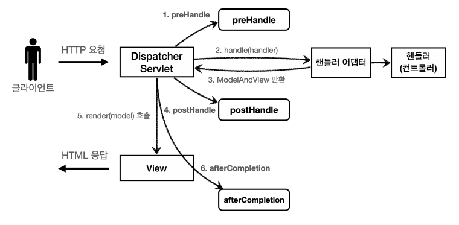
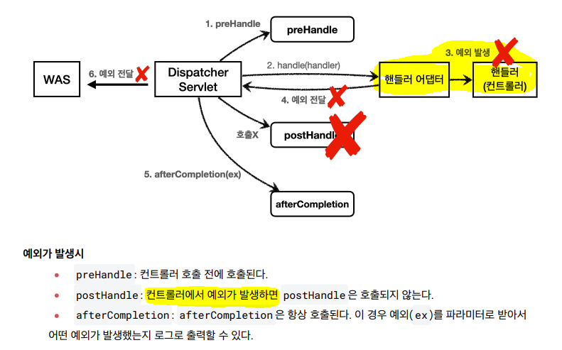

## 필터
### 서블릿 필터
특정 페이지에 다음과 같은 조건이 붙으면 어떻게 할것인가?
- 로그인 한 사용자만 들어갈 수 있는 페이지가 구분되어야 한다.
- 로그인을 하지 않은 사용자에게는 특정 관리 버튼이 보이지 않아야 한다.

### 공통 관심사?
애플리케이션 여러 로직에서 공통으로 관심이 있는 있는 것을 공통 관심사(cross-cutting concern)라고 한다.
여기서는 등록, 수정, 삭제, 조회 등등 여러 로직에서 공통으로 인증에 대해서 관심을 가지고 있다.
위 같은 **인증**은 공통관심사로 칠 수 있다.

공통 관심사는 스프링의 AOP로도 해결할 수 있지만, 웹과 관련된 공통 관심사는 지금부터 설명할 서블릿 필터
또는 스프링 인터셉터를 사용하는 것이 좋다.
- 해당 조건을 처리하기 위해 필터나 인터셉터를 사용하는데, 서블릿 필터나 스프링 인터셉터를 사용할 수 도 있다.
- 서블릿 필터 (참고로 스프링을 사용하는 경우 여기서 말하는 서블릿은 스프링의 디스패처 서블릿으로 생각하면 된다.)
- 스프링 인터셉터

### 1. 서블릿 필터

#### 필터 흐름 
- HTTP 요청 -> WAS -> 필터 -> 서블릿 -> 컨트롤러
- 필터를 적용하면 필터가 호출 된 다음에 서블릿이 호출된다.
- 그래서 모든 고객의 요청 로그를 남기는 요구사항이 있다면 필터를 사용하면 된다. 참고로 필터는 특정 URL 패턴에 적용할 수 있다. 
- /* 이라고 하면 모든 요청에 필터가 적용된다. 참고로 스프링을 사용하는 경우 여기서 말하는 서블릿은 스프링의 디스패처 서블릿으로 생각하면 된다.

필터는 여러개를 만들 수 있으며, 각 싱글턴으로 빈으로 등록해 사용한다.
- 필터 인터페이스를 구현하고 등록하면 서블릿 컨테이너가 필터를 싱글톤 객체로 생성하고, 관리한다.

필터 제한(필터에서 적절하지 않은 요청이라고 판단하면 거기에서 끝을 낼 수도 있다. 그래서 로그인 여부를 체크하기에 딱 좋다.)
- HTTP 요청 -> WAS -> 필터 -> 서블릿 -> 컨트롤러 //로그인 사용자
- HTTP 요청 -> WAS -> 필터(적절하지 않은 요청이라 판단, 서블릿 호출X) //비 로그인 사용자

필터 체인 (HTTP 요청 -> WAS -> 필터1 -> 필터2 -> 필터3 -> 서블릿 -> 컨트롤러)

#### 정리하자면 서블릿 필터에서 필터는 걸러내는 개념보다. 조건에 맞춰 뭔가 처리해주는 개념으로 보는게 맞다.
- 해깔릴 수도 있겠지만 스트림의 필터처럼, 조건을 걸고 쳐낼 수도, 조건에 맞으면 작업을 추가할 수도 있다. 

### 2. 스프링 인터셉터

스프링 인터셉터도 서블릿 필터와 같이 웹과 관련된 공통 관심 사항을 효과적으로 해결할 수 있는 기술이다.
서블릿 필터가 서블릿이 제공하는 기술이라면, 스프링 인터셉터는 스프링 MVC가 제공하는 기술이다. 둘다 웹과 관련된 공통 관심 사항을 처리하지만, 적용되는 순서와 범위, 그리고 사용방법이 다르다.

흐름
- HTTP 요청 -> WAS -> 필터 -> 서블릿 -> 스프링 인터셉터 -> 컨트롤러
- 스프링 인터셉터는 디스패처 서블릿과 컨트롤러 사이에서 컨트롤러 호출 직전에 호출 된다.
- 스프링 인터셉터는 스프링 MVC가 제공하는 기능이기 때문에 결국 디스패처 서블릿 이후에 등장하게 된다.
  - 스프링 MVC의 시작점이 디스패처 서블릿이라고 생각해보면 이해가 될 것이다.
- 스프링 인터셉터에도 URL 패턴을 적용할 수 있는데, 서블릿 URL 패턴과는 다르고, 매우 정밀하게 설정할 수 있다.

### 스프링 인터셉터 핵심
- Dispatcher 서블릿 다음에 동작하는게 핵심이다. 사진을 참고

- preHandle  컨트롤러 호출 전에 호출된다. (더 정확히는 핸들러 어댑터 호출 전에 호출된다.)
  - preHandle도 한개이상 여러개 둘 두 있으며(기본값true로 다음 핸들러이어짐), 조건에 맞춰 flase로 서블릿을 바라보고 컨트롤러 호출
- postHandle 컨트롤러 호출 후에 호출된다. (더 정확히는 핸들러 어댑터 호출 후에 호출된다.)
- afterCompletion 뷰가 렌더링 된 이후에 호출된다.
- 이 세가지 위치에서 인터셉터라는 이름처럼 참견하는 방식

### 스프링 인터셉터 예외상황 

- 예외가 컨트롤러에서 발생하면, postHandler은 호출되지 않는다.
- 컨트롤러 예외와 무관하게 공통 처리를 하려면, afterCompletion을 사용해야 한다.
  - 예외 발생시 afterCompletion을에 예외정보를 포함해서 출력시키는 것도 가능하다. ()

인터셉터는 스프링 MVC 구조에 특화된 필터 기능을 제공한다고 이해하면 된다.
스프링 MVC를 사용하고, 특별히 필터를 꼭 사용해야 하는 상황이 아니라면 인터셉터를 사용하는 것이 더 편리하다.